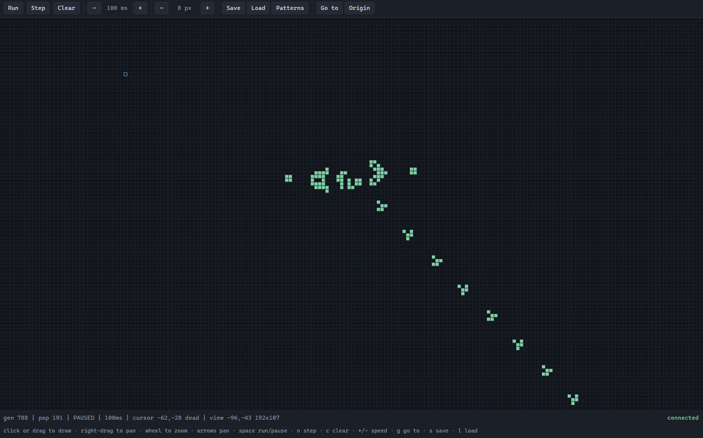
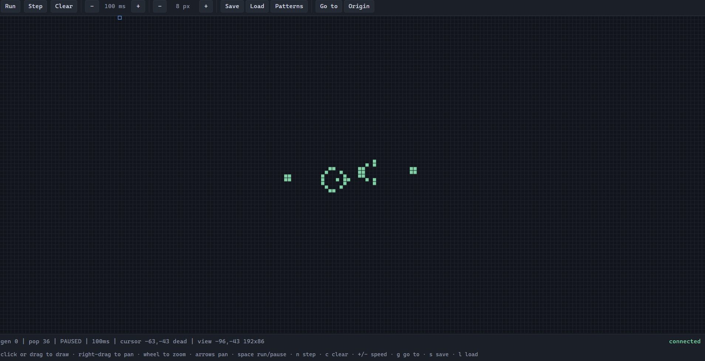

# Multiplayer Conway's Game of Life

One server owns a 2<sup>64</sup> x 2<sup>64</sup> toroidal universe; any number of clients watch it
and edit it together, in a terminal over TCP or in a browser on an HTML canvas. Everything is plain
Java 25 plus [JLine](https://github.com/jline/jline3) for the terminal and JUnit 5 for the tests;
the browser client has no dependencies at all.



The same universe, from a terminal client:

```
   █ █    ██
    ██    ██       gen 431 | pop 66 | RUNNING | 100ms | cursor -3,7 dead | view -60,-27 120x27 | localhost:7777
    █             arrows move  space toggle  enter run/pause  n step  c clear  +/- speed  g goto  s save  l load  q quit
```

## Build and run

Requires a JDK 25 on the path. Maven itself is downloaded by the wrapper, so nothing else needs
installing.

```bash
./mvnw clean verify          # compile, run the tests, build target/life.jar
```

Start a server, then open as many clients as you like:

```bash
java -jar target/life.jar server                              # TCP 7777, browser on 8080
java -jar target/life.jar server 7777 gosper-glider-gun       # ... preloaded with the example
java -jar target/life.jar server --web 9000                   # ... browser on another port
java -jar target/life.jar server --no-web                     # ... terminal clients only
java -jar target/life.jar client                              # connect to localhost:7777
java -jar target/life.jar client 192.168.1.10:7777            # connect to another machine
java -jar target/life.jar client --ascii                      # draw cells as '#' instead of a block
```

A one-minute tour: start the server, open <http://localhost:8080> and connect a terminal client
too. Press `l` in the terminal and type `gosper-glider-gun`. The browser shows the same gun
appear, and either window can now pause it, draw cells or change the speed.

### Shortcut scripts

The commands worth repeating are also one-line `.bat` files next to `pom.xml`, so a demo needs no
typing: double-click them, or run them from a terminal.

| Script | What it starts |
| --- | --- |
| [`start-server-clean.bat`](start-server-clean.bat) | a server with an empty universe |
| [`start-server-glider-gun.bat`](start-server-glider-gun.bat) | a server preloaded with `gosper-glider-gun` |
| [`start-server-pulsar.bat`](start-server-pulsar.bat) | a server preloaded with `pulsar` |
| [`start-client-utf8.bat`](start-client-utf8.bat) | a terminal client drawing cells as `█` |
| [`start-client-ascii.bat`](start-client-ascii.bat) | a terminal client drawing cells as `#` |
| [`start-client-web.bat`](start-client-web.bat) | the browser client at <http://localhost:8080> |

All of them assume `target/life.jar` has been built and that a server is started before any
client. The server scripts use the default ports, so `start-client-web.bat` matches them; if you
change the ports on the command line, open the browser yourself rather than through the script.
They are a Windows convenience only — everything they do is one of the `java -jar` lines above,
which is what to use on Linux and macOS.

## Browser client



`http://localhost:8080` serves a canvas on the same universe as the TCP port. Click or drag to
draw, right-drag to pan, the wheel zooms, and the toolbar and keys mirror the terminal client
(`space` run/pause, `n` step, `c` clear, `+`/`-` speed, `g` go to, `s`/`l` save and load). Because
the coordinates go past 2<sup>53</sup>, where JavaScript numbers stop being exact, the client uses
`BigInt` throughout and wraps with the same unsigned comparison the server uses; opening the page
as `#selftest` runs those checks in the browser and reports in the toolbar.

A browser cannot open a raw socket, so the same line protocol is carried over HTTP rather than
replaced:

| Route | Purpose |
| --- | --- |
| `GET /events` | Server-Sent Events; each message is one `data:` line of the protocol below |
| `POST /command` | one protocol line as the body; `204` when the change was broadcast |
| `GET /`, `/app.js`, `/style.css` | the client, served from inside the jar |

Server-Sent Events fit the traffic — a stream outwards, the occasional keystroke inwards — and
need no framing code and nothing beyond `com.sun.net.httpserver` in the JDK. WebSocket would have
meant hand-writing RFC 6455 or adding an embedded servlet container.

## Keys

| Key | Action |
| --- | --- |
| arrows | move the cursor; the view scrolls when the cursor reaches an edge, so the 100 x 100 area is reachable in any window size |
| `space` | bring the cell under the cursor to life, or kill it |
| `enter` | start or pause the simulation |
| `n` | advance exactly one generation |
| `c` | kill every cell and reset the generation counter |
| `+` / `-` | run faster or slower (10 ms to 5000 ms per generation) |
| `[` / `]`, `PgUp` / `PgDn` | move a whole screen sideways or vertically |
| `g` | jump to a coordinate, for example `9223372036854775807,0` to sit on the wrap seam |
| `0` / `Home` | return to the origin |
| `s` | save the current state on the server under a name |
| `l` | load a saved state (the names available are shown as you are asked) |
| `q` | quit the client; the server and the other clients carry on |

Every client sees every change immediately, including cells another player is drawing, so two
people can build a pattern together while it runs.

## Pattern files

States are stored on the server in `patterns/`, one plain text file each, in the Life community's
`.cells` format with two extra headers so that a file restores a state exactly:

```
!Name: Gosper glider gun
!Origin: -18 -4      absolute coordinate of the top-left character
!Generation: 0       generation counter to restore
........................O
......................O.O
............OO......OO............OO
...........O...O....OO............OO
OO........O.....O...OO
OO........O...O.OO....O.O
..........O.....O.......O
...........O...O
............OO
```

`O` (also `o` or `*`) is a live cell and `.` (also a space) a dead one; trailing dead cells may be
omitted and `!` lines are comments.

Four examples ship with the project, each centred on the origin so it appears in a client's
default view. Press `l` in a client and type the name:

| Name | Cells | Behaviour |
| --- | --- | --- |
| [`gosper-glider-gun`](patterns/gosper-glider-gun.cells) | 36 | unbounded growth: a new glider every 30 generations |
| [`blinker`](patterns/blinker.cells) | 3 | period 2 oscillator, the smallest there is |
| [`beacon`](patterns/beacon.cells) | 8 | period 2 oscillator; the population alternates 8, 6 |
| [`pulsar`](patterns/pulsar.cells) | 48 | period 3 oscillator with four-fold symmetry |

Because `!Origin` is absolute, a pattern saved near the wrap seam reloads exactly where it was
rather than near zero.

## Protocol

Line-oriented UTF-8 over TCP, one message per line. It is plain text on purpose: a game can be
watched, or driven, with nothing more than `telnet`.

| Direction | Message | Meaning |
| --- | --- | --- |
| client to server | `toggle <x> <y>` | flip one cell |
| | `start`, `stop`, `step` | run, pause, advance one generation |
| | `clear` | empty the universe |
| | `speed <millis>` | delay between generations, clamped to 10..5000 |
| | `patterns` | ask which saved patterns exist |
| | `save <name>`, `load <name>` | store or restore a state on the server |
| server to client | `state <generation> <running> <speedMillis> [<x>,<y> ...]` | the complete shared state |
| | `notice <text>` | a command succeeded but changed nothing visible |
| | `error <text>` | a command failed, sent only to the client that sent it |

```console
$ telnet localhost 7777
state 0 false 100
load gosper-glider-gun
state 0 false 100 -18,0 -17,0 -18,1 ...
```

A new client receives a `state` line immediately, so it can join a running game at any time, and
every change is broadcast to everyone. Names in `save`/`load` must match
`[A-Za-z0-9._-]{1,64}`, which is what keeps them inside the `patterns/` directory.

## Design notes

**The torus is free.** Coordinates are `long`, and Java's `long` arithmetic wraps modulo
2<sup>64</sup>, so the neighbour to the right of `Long.MAX_VALUE` *is* `Long.MIN_VALUE`. There is no
modulo, no bounds check and no special case for the edges anywhere in the code; the universe is a
torus because two's-complement arithmetic already is one. The same trick makes the viewport work:
`contains` subtracts the left edge and compares the result as an *unsigned* number, so a window
straddling the seam behaves like any other.

**Only live cells exist.** `Universe` holds an immutable `Set<Cell>`, and a generation is computed
by counting the neighbours of live cells only. Cost scales with the population, not with the size
of the universe, which is what makes a universe of 2<sup>128</sup> cells practical: a glider gun
costs the same here as it would on a 100 x 100 board. It also means a universe is a value, so the
rules are testable without a server, a socket or a clock.

**One writer, immutable messages.** `Game` is the only mutable object and every method on it is
`synchronized`, so the tick thread and the client threads cannot interleave. Each command produces
exactly one reply: a `state` that everyone gets, or a `notice`/`error` that only the sender gets.

**Two front ends, one hub.** `GameHub` owns the game, the clock and the list of watchers; a front
end reduces its transport to `submit` for a command and `subscribe` for a stream of updates.
`GameServer` is that for TCP and `WebServer` is that for HTTP, which is why a browser tab and a
terminal are genuinely in the same game rather than two systems kept in step. It also means the
fan-out and the slow-client policy are written once.

**Slow clients are dropped, not tolerated.** Each subscriber has its own writer virtual thread and
a 64-line outbound queue. A client that stops reading fills its queue and is disconnected, which
keeps one stalled terminal or one backgrounded tab from slowing the simulation or the other
players.

**One character per cell.** A live cell is a solid block `█` and a dead one a space. The client
opens its terminal as UTF-8 so the block is written correctly whatever the platform's default
encoding is — on Windows the console reports a legacy code page while rendering Unicode perfectly
well, so trusting that report would needlessly degrade the display. `--ascii` draws `#` instead for
a terminal that genuinely cannot manage the block, and a terminal that reports itself as `dumb`
gets `#` automatically. Packing two cells into one character with half-blocks would
fit twice as many rows on screen, but it makes the cursor cover two cells at once; drawing one cell
per character keeps what you see and what you edit the same thing, and the view simply scrolls when
the cursor reaches an edge. Rendering is a pure function from state to strings, which is why it can
be tested without a terminal.

**Known limits.** Every generation broadcasts the whole live set. For the patterns this program is
built for (hundreds to thousands of cells) that is a few kilobytes per tick and keeps both ends
stateless. A universe with millions of live cells would need either deltas or per-client viewport
subscriptions; that is a deliberate trade, not an oversight.

There is no authentication and no TLS on either port: anyone who can reach the machine can edit
the universe and save patterns. That is the right shape for the game this is — players are meant
to interfere with each other — but it means both ports belong on a trusted network.

## Layout

```
src/main/java/life/
  Main.java              command line: server or client
  core/                  the rules, independent of any I/O
    Cell.java            a coordinate pair; neighbours wrap by construction
    Universe.java        an immutable generation as a sparse set of live cells
    PatternFile.java     read and write .cells files
  net/
    Message.java         sealed hierarchy of everything on the wire
    Wire.java            text codec, one exhaustive switch each way
    Game.java            the single shared mutable state
    GameHub.java         the game, the tick schedule and the fan-out, transport-free
    GameServer.java      TCP front end: accept loop and per-client sessions
    GameClient.java      client connection and listener
  ui/
    Viewport.java        which part of the torus is on screen
    Glyphs.java          the characters a cell is drawn with
    Renderer.java        state to lines of text, pure
    Console.java         JLine terminal, key bindings, repaint loop
  web/
    WebServer.java       HTTP front end: SSE stream, posted commands, the page
src/main/resources/web/  the browser client: index.html, app.js, style.css
start-*.bat              one-line shortcuts for the usual server and client commands
```

`docs/plan.md` and `docs/tasks.md` record the design and the checklist the implementation followed.

## Tests

```bash
./mvnw test
```

151 tests, no mocks. The ones worth knowing about:

- `TorusTest` runs a blinker and a glider across the seam between `Long.MAX_VALUE` and
  `Long.MIN_VALUE`, on both axes at once, and asserts they behave exactly as they do in the middle
  of the universe.
- `PatternFileTest` round-trips patterns through text, including one straddling both seams, and
  checks the example files really are what they claim: the 36-cell Gosper gun reappears unchanged
  with one new glider after exactly 30 generations, and each shipped oscillator returns to its
  starting cells after its stated period and not one generation sooner.
- `WireTest` round-trips every message variant, including a 1000-cell state and extreme
  coordinates.
- `GameServerTest` starts a real server on a real port and drives two real clients through it:
  an edit by one is seen by the other, a step advances both, a failed command reaches only the
  client that sent it, a departing client does not disturb the rest, and a raw socket sees the
  documented plain text.
- `GameHubTest` covers the fan-out on its own, including a subscriber whose sink never returns:
  it is dropped once its queue fills, while a healthy subscriber alongside it keeps receiving.
- `WebServerTest` drives the browser front end over real HTTP, and ends with the test the whole
  design is for — a terminal client and an event stream on one hub, where an edit made in either
  arrives in the other.

## Using AI agents for this task

The work was done with an AI coding agent and the process is part of the deliverable, so it is
recorded in the repository rather than described after the fact:

1. **Plan before code.** `docs/plan.md` fixes the decisions that are expensive to change later:
   `long` coordinates for the torus, a sparse immutable universe, line-oriented text over TCP, a
   pure renderer. It also records the assumptions that were checked with the reviewer instead of
   guessed.
2. **A checklist with exit criteria.** `docs/tasks.md` breaks the plan into small tasks, each with
   a concrete "done when" that is a test or a command, so progress is verifiable rather than
   asserted.
3. **Tests as the gate between phases.** The engine was made provably correct before any socket
   existed; the protocol before the server; the server before the UI. Each phase ended with a green
   build, so a later mistake could only be in the layer being written.
4. **Human review at the decision points.** The choice of JLine over a hand-rolled key reader, the
   scope of the 100 x 100 editing area and the JDK version were decided in conversation, not by the
   agent alone.
